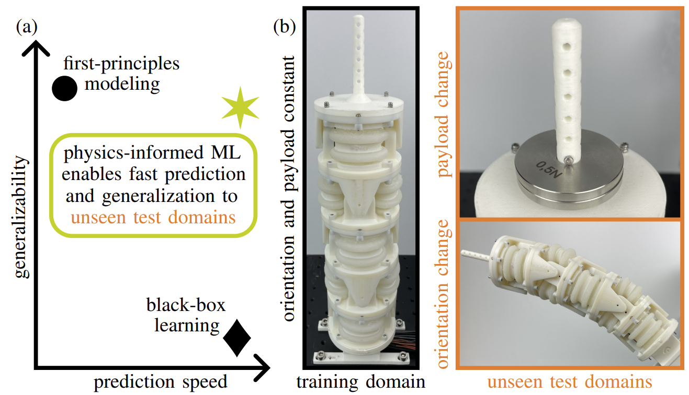

# Physics-Informed Neural Networks for Learning and Control
<p align="center">

</p>

**This repository refers to the current T-RO submission. Due to the double-blind procedure, external hyperlinks to our public website have been removed. After acceptance, this anonymous repository will be deleted and only the non-anonymous repository (as part of our website) will remain.**

This page describes the implementation of a learning-based nonlinear model predictive control (NMPC) using physics-informed neural networks (PINNs), which is experimentally validated with SPONGE. PINNs are trained in PyTorch, and their hyperparameters are optimized via ASHA. One PINN is integrated into a ROS package (``sponge_mpc``) and used as model within NMPC. For this purpose, CasADi is used in a ROS service (C++ node) which communicates with Simulink, enabling its use on the real-time hardware. The test-bench software is based on the originally test-bench software (**hyperlink removed due to double-blind procedure**). It is therefore recommended that you familiarize yourself with this.

**The code for PINN training, hyperparameter optimization and learning-based NMPC with PINNs can be found in this repo. Also, 13 open-source real-world datasets of SPONGE with five actuators are available.**

## Additional Requirements
- [CasADi](https://github.com/casadi/casadi/wiki/InstallationLinux) installed as a source build with IPOPT solver
- [json.hpp](https://github.com/nlohmann/json) copied to [include folder](https://github.com/TRO-PINN2025/anonymous/tree/main/catkin_ws/src/sponge_mpc/include)

## Usage
1. Set up the test bench following these instructions (**hyperlink removed due to double-blind procedure**). The ROS-interface is used, which is explained here (**hyperlink removed due to double-blind procedure**)
2. Dev-PC: Initialize parameters and open Simulink model via ``init.m``
3. Dev-PC: If necessary, modify Simulink model
4. Dev-PC: Compile the model by pressing ``Ctrl+b``
5. Dev-PC: Compile ROS-Workspace and copy to RT-PC via ``$ ./build.sh && ./sync.sh``
6. Connect to RT-PC via SSH and run the following commands on RT-PC: ``$ sudo /etc/init.d/ethercat start`` (start EtherCAT master) and ``$ ~/app_interface/ros_install/scripts/autostart.sh && tmux attach-session -t app`` (start compiled model)
7. Dev-PC: Launch ROS service for PINN-based MPC via ``roslaunch sponge_mpc sponge_mpc.launch``
8. Dev-PC: Start external mode in Simulink model via ``Connect To Target`` to visualize/record data or alter settings (such as starting the MPC experiment)
9. After the experiment on RT-PC: ``Ctrl+c`` in tmux window, ``$ tmux kill-session -t app`` and ``$ sudo /etc/init.d/ethercat stop`` to stop the EtherCAT master

## Citing
The paper will be freely available via arXiv. If you use parts of this project for your research, please cite the following publication:
```
Generalizable and Fast Surrogates: Model Predictive Control of Articulated Soft Robots using Physics-Informed Neural Networks
Anonymous
Currently under review
```
